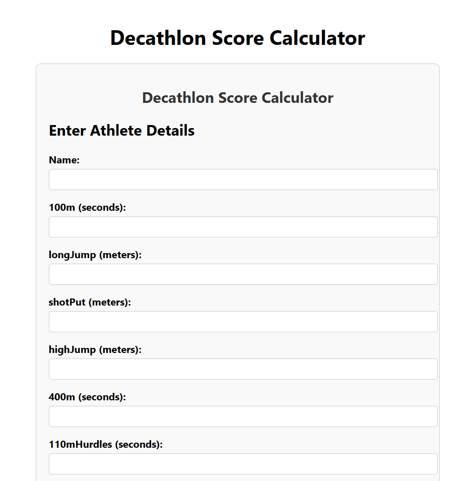
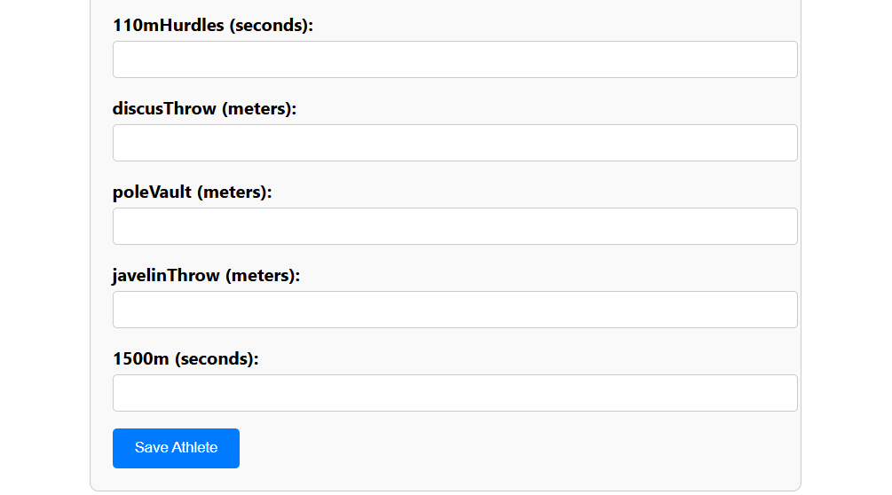
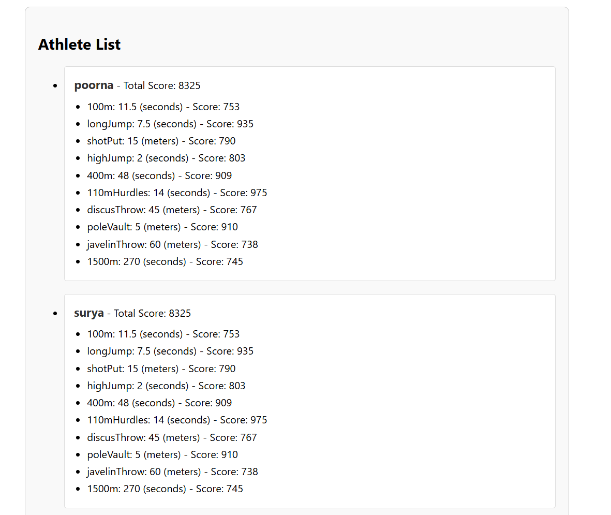
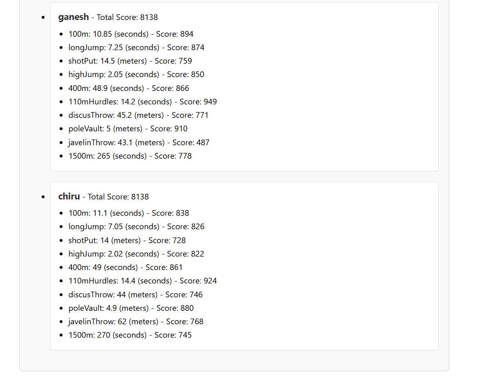

# Decathlon-App
A dynamic web application designed to calculate decathlon scores for athletes based on their performance in ten events. This project implements official decathlon scoring algorithms and provides an intuitive, responsive user interface for data entry and result visualization.
## Features

- Athlete Management – Add, view, and manage athlete details.
- Real-time Scoring – Automatically calculates event scores and total score using official decathlon rules.
- Responsive Design – Optimized for both desktop and mobile views.
- Error Handling – Displays meaningful messages for invalid inputs.

## Setup Instructions

### Prerequisites

- Node.js and npm must be installed on your system.
- A backend server must be running to handle API requests (e.g., http://localhost:5000/api/athletes).
## Steps to run locally
### 1.Clone the repository
```bash
git clone https://github.com/ganeshkosuri-07/decathlon-app.git
cd decathlon-app
```
### 2.Setup backend
```bash
cd backend
npm install
node server.js

```
### 3.Setup frontend
```bash
cd ..
cd frontend
npm install
```
### 4.Start the application
```bash
npm Start
```
The app will be available at http://localhost:3000.
### 5.If error occurs to start the application use this commands
```bash
npm install --save-dev webpack@latest webpack-cli@latest react-scripts@latest
npm start
```
## Key Features
- Accurate Event Scoring : Implements official decathlon scoring formulas for all ten events.
-  Interactive Form : Simple and clean interface for entering athlete performance metrics.
-  Real-Time Feedback : Instant score calculations and updates.
-  Responsive Layout : Ensures a seamless experience across devices.
-  Smooth Animations : Elegant transitions for a better user experience.

## Screenshots










## Technologies used
- Frontend: React, CSS (with responsive design principles).
- Backend: Node.js (API server for handling athlete data).
- Libraries:
    - Axios: For API requests.
    - React Hooks: State management.

## Future enhancements
1.User Authentication: Secure login and personalized athlete tracking.

2.Export Functionality: Download results as PDF or Excel.

3.Performance Analytics: Provide insights and trends for athletes over time.
## Acknowledgments
Scoring formulas are based on official decathlon scoring rules.
## Contact
- Email: kosuriganesh07@gmail.com
- LinkedIn:[]
